You will be submitting your final project documents on GitHub (due by **October 19th**). The tool we will be using is called git and GitHub. This is a tutorial that will help you install the tool git on your computer and create a GitHub account. 
 
## Create your GitHub account
  
  To sign up for an account, just go to [github](https://github.com) 
  and pick a unique username, an email address, and a password. 
  Once you've done that, your github page will be at 
  `https://github.com/<your-username-here>`.
  
## Setting up your git environment
  
### 1. Installing git
  
  We will be using the [command line version of git](http://git-scm.com/docs/gittutorial).
  
  On Linux, install git using your system package manager (yum, apt-get, etc). 
  
  On the Mac, if you ever installed [Xcode](https://developer.apple.com/xcode/),
  you should have git installed. Alternatively, you may have installed 
  it using `homebrew`. Either of these are fine as long as the 
  git version is greater than 2.0. To determine the version of git 
  that is installed on your computer, open a terminal window and type:
    
    > $ `git --version`
  
  If git is installed, you should see a version number. Check to see if it 
  is greater than version 2.0. If it is not, please update your version 
  of git. 
  
  If git is not installed on your Mac and Windows, go to http://git-scm.com. 
  Accept all defaults in the installation process. 
  On Windows, installing git will also install for you a minimal 
  unix environment with a "bash" shell and terminal window. 
  Voila, your windows computer is transformed into a unixy form.
  
#### Windows specific notes
  
  There will be an installer `.exe` file you need to click. Accept all the defaults.
  
  Here is a screen shot from one of the defaults. It makes sure you will have the "bash" tool talked about earlier.
  
  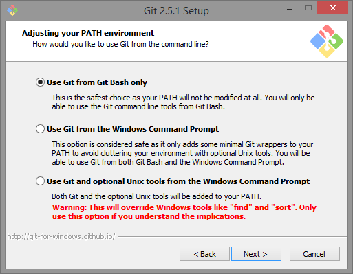
  
  Choose the default line-encoding conversion:
    
    
  
  Use the terminal emulator they provide, its better than the one shipped with windows.
  
  
  
  Towards the end, you might see a message like this. It looks scary, but all you need to do is click "Continue"
  
  
  
  
  At this point you will have git installed. You can bring up "git bash" 
  either from your start menu, or from the right click menu on any 
  folder background. When you do so, a terminal window will open. 
  This terminal is where you will issue further git setup commands, 
  and git commands in general.
  
  Get familiar with the terminal. It opens in your home folder, and 
  maps `\\` paths on windows to more web/unix like paths with '/'. 
  Try issuing the commands `ls`, `pwd`, and `cd folder` where folder 
  is one of the folders you see when you do a ls. You can do 
  a `cd ..` to come back up.
  
  
#### Mac specific notes
  
  As mentioned earlier, if you ever installed Xcode or the 
  "Command Line Developer tools", you may already have git.
  Make sure its version 2.0 or higher. (`git --version`)
  
  Or if you use **Homebrew**, you can install it from there. 
  The current version on homebrew is 2.4.3
  You don't need to do anything more in this section.
  
  -----
  
  First click on the `.mpkg` file that comes when you open the 
  downloaded `.dmg` file.
  
  When I tried to install git on my mac, I got a warning saying my 
  security preferences wouldn't allow it to be installed. So I opened 
  my system preferences and went to "Security".
  
  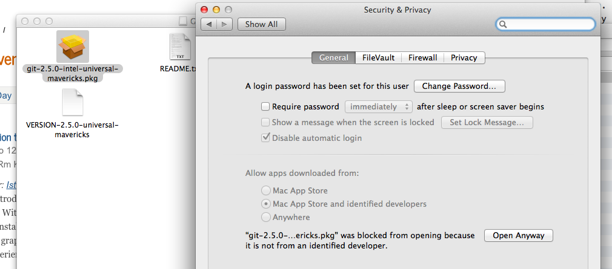
  
  Here you must click "Open Anyway", and the installer will run.
  
  The installer puts git as `/usr/local/git/bin/git`. 
  That's not a particularly useful spot. Open up `Terminal.app`. 
  It's usually in `/Applications/Utilities`. Once the terminal opens up, issue
  
  > $ `sudo ln -s /usr/local/git/bin/git /usr/local/bin/git`
  
  Keep the Terminal application handy in your dock. (You could also 
                                                     download and use iTerm.app, which is a nicer terminal, if you are into 
                                                     terminal geek-ery). We'll be using the terminal extensively for git. 
  
  Try issuing the commands `ls`, `pwd`, and `cd folder` where 
  folder is one of the folders you see when you do a ls. You 
  can do a `cd ..` to come back up.
  
### 2. Setting global config for git
  
  Again, from the terminal, issue the command
  
  `git config --global user.name YOUR NAME`
  
  This sets up a name for you. Then do
  
  `git config --global user.email YOUR EMAIL ADDRESS`
  
  Use the **SAME** email address you used in setting up your github account.
  
  These commands set up your global configuration. On my Mac, 
  these are stored in the text file `.gitconfig` in my home folder.
  
## GitHub and the Terminal

This tutorial will walk you through 
the process of using git and GitHub through the command line. 

### Getting and Working on your Project

#### Cloning your project repository
Each of you should have received invites to a personal final project repository.

1. Go to: https://github.com/reproducibleresearch

2. Click on the repository you want to work on (the one that includes your github username). For example `<your_GitHub_username>-final-project`. 

3. Copy the link near the top of the page that is revealed after clicking 'clone or download'.

 
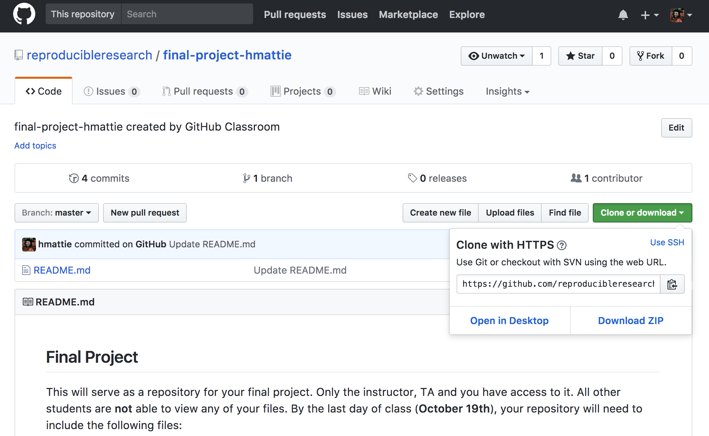

4. Go to your `Terminal` (on Mac) or `git bash` (on Windows), 
change directories into your BST270 folder.

5. Use `git clone` to clone the repository using the link from step 3. For example:

> `$ git clone https://github.com/reproducibleresearch/final-project<your_GitHub_username>.git`

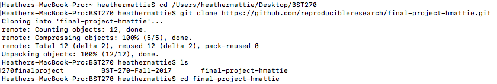

6. You should now see a new directory called `<your_GitHub_username>-final-project`. 
Move into that directory with `cd` (shown in the last line of the previous image). 

7. If you type `git status` it will give you the current status of your 
directory. It should look something like this:

 
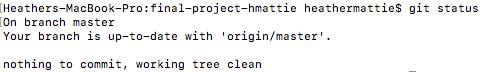

#### Working on your project

Once you have a local copy of your repository, it's time to get to work! 

After writing, coding and making pretty plots and tables, it's time to `add/commit/push`. If you head back to `Terminal` you will see that something has changed when you type `git status`:

 
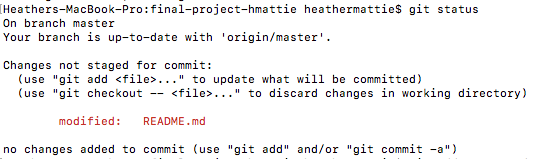

You will notice that there is one `untracked file`.
In order to get git to track changes in this file we need to 
add it. So we type :

> `$ git add HW2_Problems.html `

We also need to add the .Rmd file in order to `stage` it (so that it
will be included in the next commit). So we type :

> `$ git add HW2_Problems.Rmd `

 
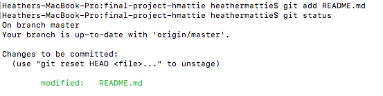

Now you will notice that the files have turned green and are now 
labeled as changes to be committed, now it's time to commit. 
This is equivalent to `save` in most programs. But what is special 
about `git` and other version control software is that we can track 
and revert changes! We also need to give what's called a `commit message`, 
which will help us keep track of the changes we made when we look at 
this in the future. Leave detailed messages so that future you will 
know what you did. Future you will thank you. We will get to this 
part later. Notice the `-am` flag, the `a` stands for *all*, 
as in all tracked files, and the `m` stands for *message*.

We do that by typing:

``
git commit -am "This is my commit message, it is very detailed."
``

 
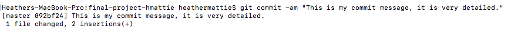

Cool! Now we've saved our work on our local directory, we can now push 
our work to Github. Note, we can (and should) do this as many times as 
we want before the project deadline. What is great about this is that 
it will make getting help from your TA and instructor easier as well as keeping a copy of your work in the cloud in case your computer crashes, or you accidentally delete something.	

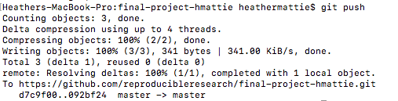

### Summary
To summarize, it is important to do the following 
steps whenever you finish working on your project to make full 
use of `git` and Github as well as generally having the best 
experience in this class. 

1. Work on your project
2. Add changes to track with: `git add`
3. Commit changes to your local repository: `git commit`
4. Push the changes to your github repo: `git push`

Generally keep this picture in mind whenever you want to do this 
loop, it is important to only add changed files you care about 
and nothing you do not care about. If certain files keep popping 
up in your git status that you will never want to add, e.g. `.Rhistory`, 
etc, add them to your `.gitignore` to simplify your life, this will keep 
those files from showing up here. 

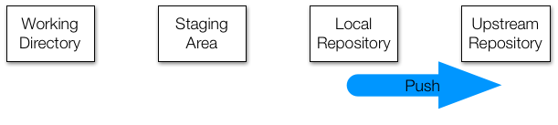

## GitHub and RStudio
This tutorial will walk you through 
the process of using git and GitHub through the command line.

### Getting and Working on Homework
Each of you should have received invites to a personal final project repository.

#### Cloning your Homework repository

1. Go to: https://github.com/reproducibleresearch

2. Click on the repository you want to work on. For 
example `<your_GitHub_username>-final-project` for your project. 

3. Copy the link near the top of the page that is revealed after clicking 'clone or download'.

 

4. In RStudio, start a new project: File > New Project > Version Control > Git. In the "repository URL" paste the URL of the homework repository you just copied. Take charge of – or at least notice! – the local directory for the Project. A common rookie mistake is to have no idea where you are saving files or what your working directory is. Pay attention. Be intentional. Personally, I suggest you check “Open in new session” and to keep your project repository in a 'BST270' folder.

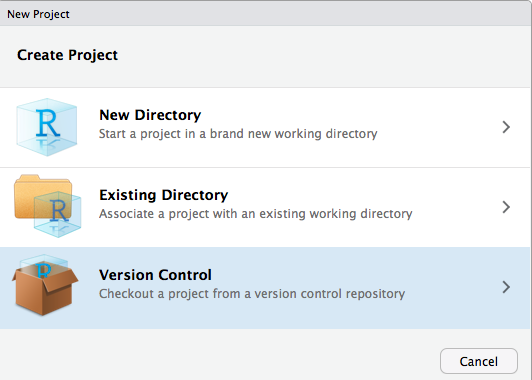

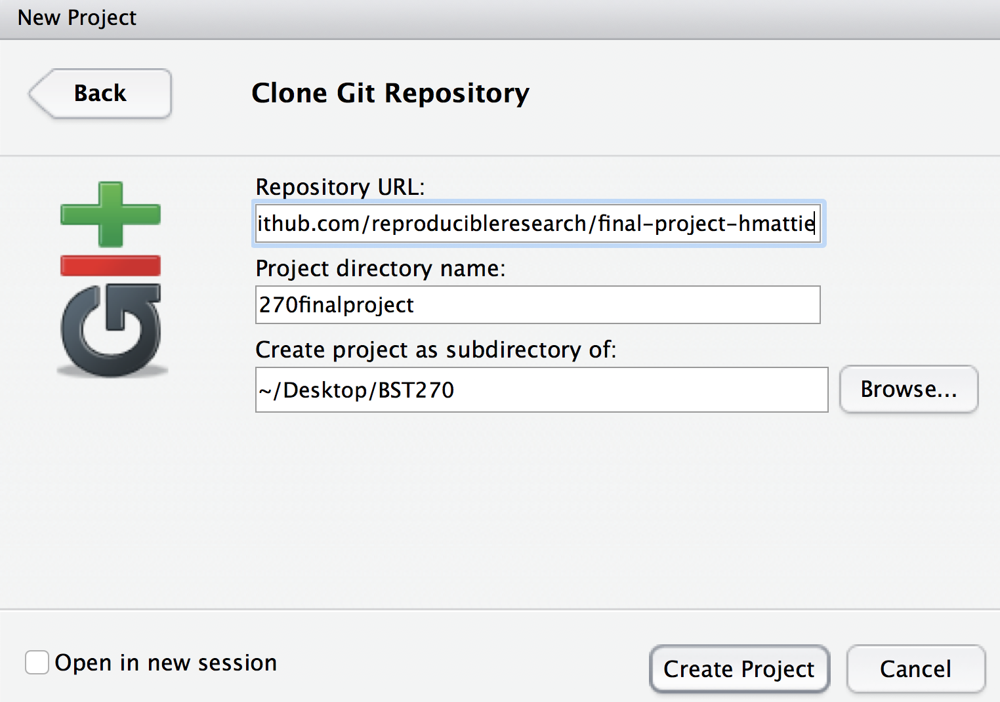

5. Click "Create Project". You should now see the files in the repository in the lower right window in RStudio. Also notice the Git tab in the upper right window.

 
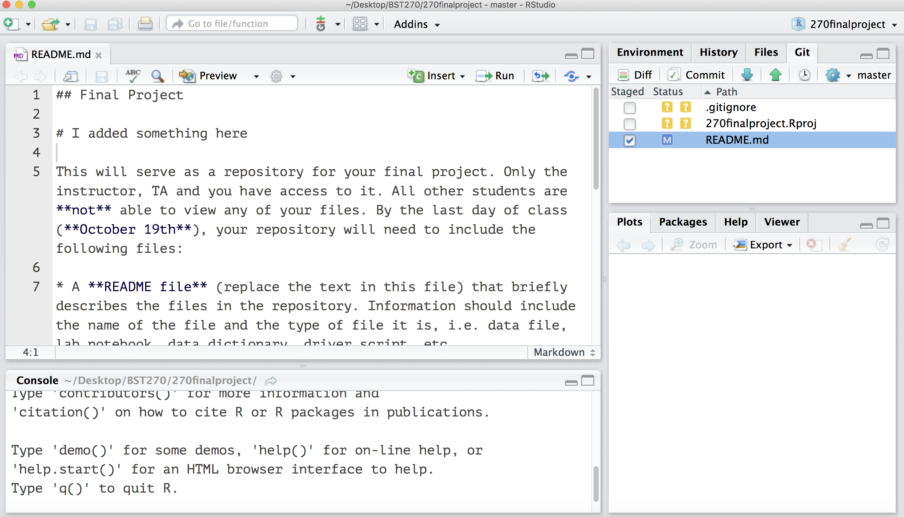

#### Working on your project

Once you have a local copy of your repository, it's time to get to work! 

After writing, coding and making pretty plots and tables, it's time to `add/commit/push`. After some work, save your changes and click the `commit` button in the Git tab window. This is equivalent to `save` in most programs. But what is special about `git` and other version control software is that we can track and revert changes! We also need to give what's called a `commit message`, which will help us keep track of the changes we made when we look at this in the future. Leave detailed messages so that future you will know what you did. Future you will thank you.  

 
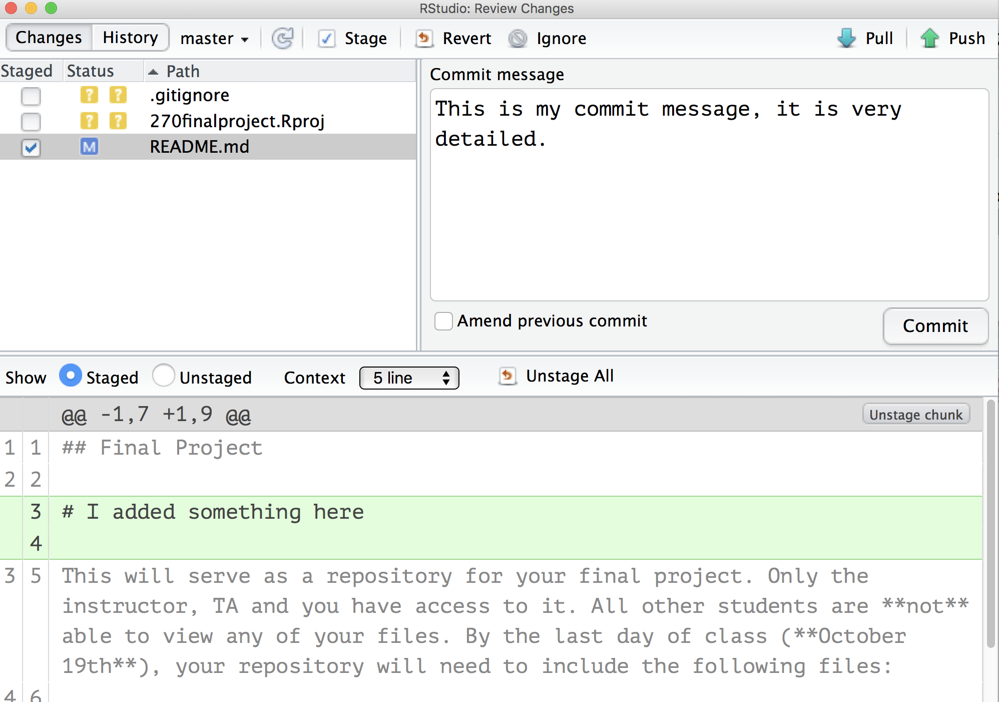

Cool! Now we've saved our work on our local directory, we can now `push` 
our work to Github by clicking the *green up-arrow* in the Git tab window. If you are challenged for username and password, provide them. Note, we can (and should) do this as many times as we want before the project deadline. What is great about this is that 
it will make getting help from your TA and instructor easier as well as keeping a 
copy of your work in the cloud in case your computer crashes, or you 
accidentally delete something.	

### Summary
To summarize, it is important to do the following 
steps whenever you finish working on your project to make full 
use of `git` and Github as well as generally having the best 
experience in this class. 

1. Work on your project
2. Commit changes to your local repository: `commit` button in Git tab in RStudio
3. Push the changes to your github repo: `push` (green arrow) button in Git tab in RStudio

Generally keep this picture in mind whenever you want to do this 
loop, it is important to only add changed files you care about 
and nothing you do not care about. If certain files keep popping 
up in your git status that you will never want to add, e.g. `.Rhistory`, 
etc, add them to your `.gitignore` to simplify your life, this will keep 
those files from showing up here. 

  